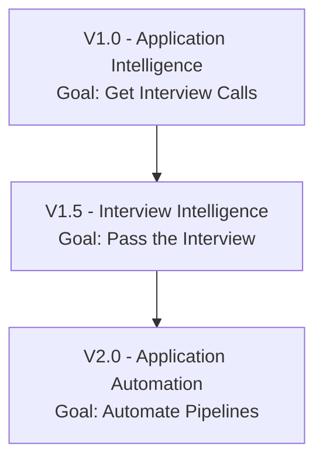

# Document 06 - Implementation Plan & Roadmap

This document outlines the implementation phases of PathPilot's feature roadmap, grouped by Version themes.

---

## Roadmap Phases

---

## Phase 1 - V1.0: Application Intelligence (Current Stable Core)

Goal: Maximize interview callback rates by generating highly tailored, ATS-optimized resumes and cover letters from a single Master Profile.

### Completed Tasks:
- **Master Profile Core**: Structured profile schemas and PDF parsing algorithms.
- **Role Recommendations**: Skills-to-role matching logic.
- **Discovery Engine**: Unified query pipeline integrating Greenhouse, Lever, Ashby, Adzuna, and Jooble.
- **Deterministic Fit Scorer**: Keyword coverage calculations, alias mapping, and seniority penalization.
- **PDF Document Compiler**: LaTeX asset compilation with a pure-Python ReportLab fallback.
- **Application Tracker**: SQLite/PostgreSQL-compatible persistent logging schema.

---

## Phase 2 - V1.5: Interview Intelligence (Current Target Build)

Goal: Prepare users for interviews using the specific context of their generated materials and the target job description.

### Roadmap Tasks:
- **Status Trigger Integration**: Unlock the Interview Prep module when application status in the Tracker updates to `Applied` or `Interview`.
- **Context Packer Service**: Implement a service that compiles the Master Profile, tailored resume content, target job description, and company name into an LLM context.
- **Structured Practice Questions Generator**:
  - **Resume Questions**: Contextual questions targeting the project details and claims written in the tailored resume.
  - **JD Questions**: Technical queries based on the target job requirements.
  - **Behavioral Questions**: Company/role-aligned behavioral mock prompts.
  - **Company Intelligence Briefs**: Generates brief summaries of the target employer's tech stack and objectives.
- **DB Persistence**: Create `interview_preps` table schema in `db_client.py` to persist practice questions and user notes.
- **UI Interface**: Build a responsive interview prep panel in Streamlit next to the tracked application record.

---

## Phase 3 - V2.0: Application Automation (Future Backlog)

Goal: Reduce manual overhead by automating the document upload and submission process.

### Backlog Tasks:
- **Form Filler Engine**: Playwright browser automation scripts to identify and fill input fields on standard career portals (Greenhouse, Lever, etc.).
- **Scheduler Scans**: Automated daily runs that fetch, filter, and queue recommended jobs based on active preferences.
- **Smart Follow-ups**: Automatically compose and draft recruiter outreach emails upon application submission.
